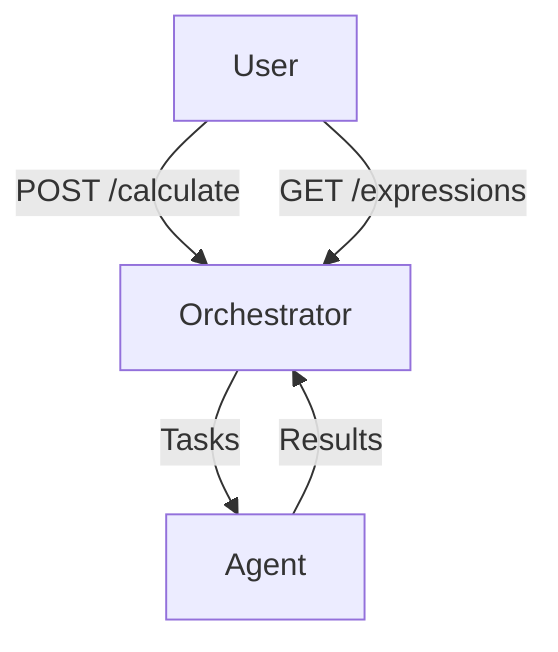

# Распределённый вычислитель арифметических выражений

## Содержание
1. [Требования](#требования)
2. [Запуск системы](#запуск-системы)
3. [Конфигурация](#конфигурация)
4. [API](#api)
5. [Архитектура](#архитектура)
6. [Примеры](#примеры)

## Требования
- Go 1.21.4+
- Docker 20.10+ (рекомендуется)

## Запуск системы
### docker compose
```bash
docker compose up --build
```

## Конфигурация
### Переменные окружения оркестратора
Переменная По умолчанию	Описание

TIME_ADDITION_MS	1000	Задержка сложения (мс)

TIME_SUBTRACTION_MS	1000	Задержка вычитания (мс)

### Переменные агента
Переменная	По умолчанию Описание

COMPUTING_POWER	2	Количество воркеров

PING	1000	Интервал опроса (мс)

## API
### Добавить выражение

```bash
curl -X POST http://localhost:8080/api/v1/calculate \
-H "Content-Type: application/json" \
-d '{"expression": "2+2*2"}'

#ответ:
{"id": "550e8400-e29b-41d4-a716-446655440000"}
```

### Получить статус

```bash
curl http://localhost:8080/api/v1/expressions/:id

#ответ:
{
  "id": "550e8400-e29b-41d4-a716-446655440000",
  "status": "completed", 
  "result": "6"
}
```

## Архитектура

## Примеры
### Ошибочное выражение
```bash
curl -X POST http://localhost:8080/api/v1/calculate \
-d '{"expression": "2++2"}'

#ответ при проверке статуса:
{
  "id": "c0b3a5b1-2f47-4a91-b45d-88d4a72a510a",
  "status": "error",
  "result": "invalid expression syntax"
}
```

p.s.
делал в сжатые сроки из за олимпиад, пощадите. . .
